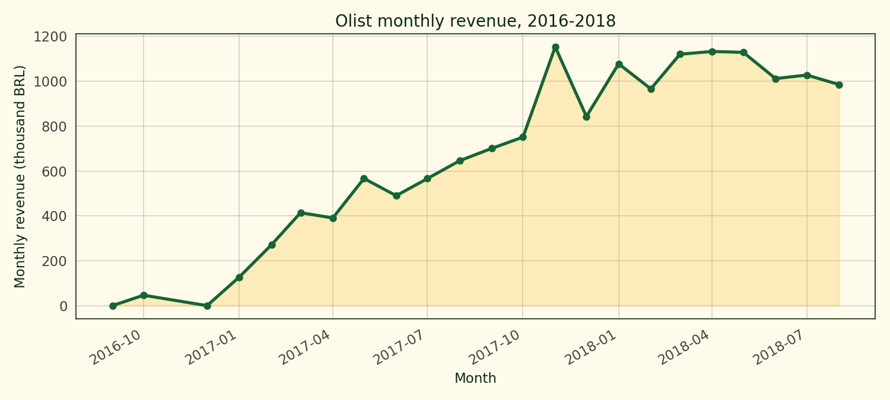
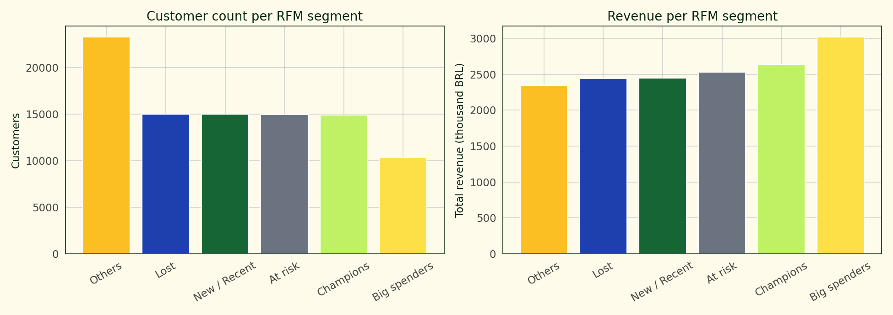
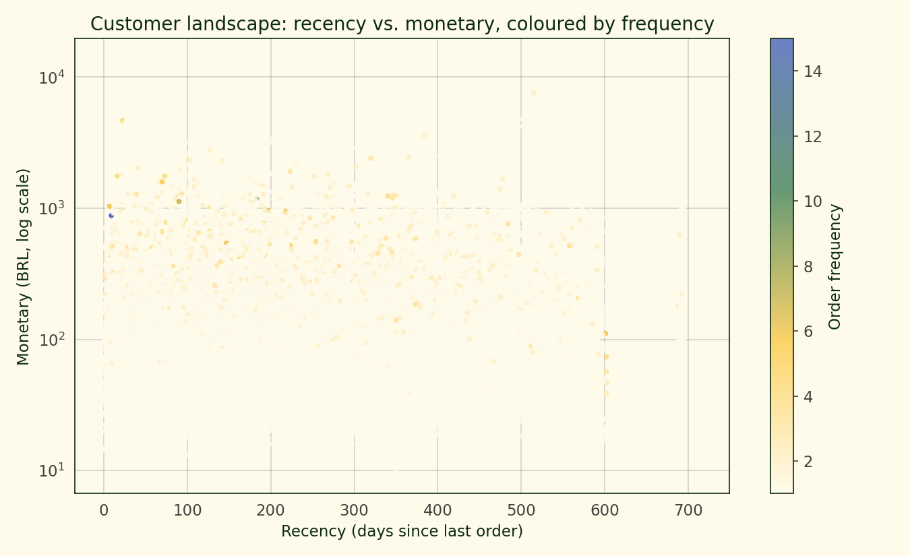
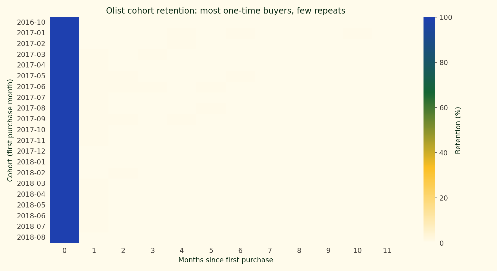
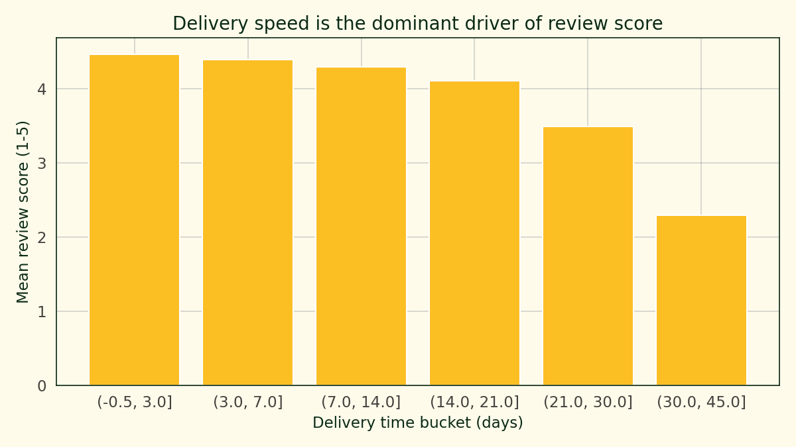
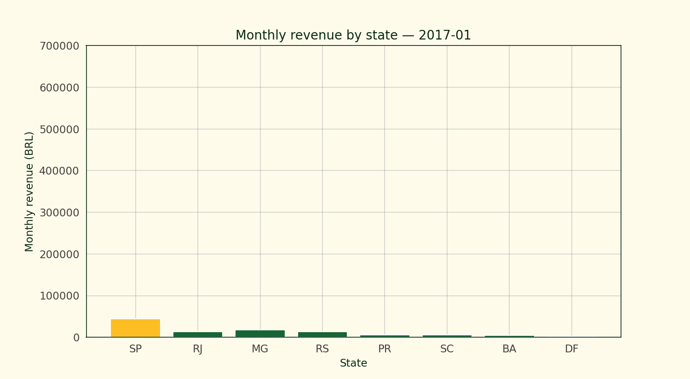

# 93,000 Customers and No Repeats: Olist Brazilian E-Commerce Analytics

The Olist dataset is 100,000 orders across 93,000 customers from a Brazilian e-commerce marketplace spanning 2016 to 2018. Nine CSV tables linked by ID. No machine learning in this project — the interesting work is joining the tables right, building an RFM segmentation that a marketing team could actually use, and looking at the cohort retention curves to answer the question every e-commerce founder wants answered: how many of these customers come back?

Short answer: almost none. More than 97 percent of Olist customers appear in exactly one delivered order during the observation window. The platform's revenue growth through 2017-2018 comes from acquiring new customers, not from repeat purchases. That shapes everything else in the analysis.

## The data

Nine CSVs that join into a clean star schema around `orders`:
- `customers` → customer IDs and locations
- `orders` → order status, timestamps
- `order_items` → prices, freight per item
- `order_payments` → payment methods and installments
- `order_reviews` → post-delivery review scores
- `products` → product categories, dimensions
- `sellers` → seller IDs and locations
- `geolocation` → zip-code-to-lat/lon
- `product_category_name_translation` → Portuguese-to-English category names

I filtered to delivered orders (96,478 of 99,441 total) and joined items to compute order totals. Total revenue comes out to R$ 15.4 million across the two years.

Revenue ramps from near-zero in October 2016 through the first serious growth in Q1 2017. November 2017 shows a distinct Black Friday spike (Brazilian "Black Friday" runs the last week of November). 2018 levels stabilise around R$ 1 million per month.

## RFM segmentation

RFM is the e-commerce standard for segmenting a customer base into actionable buckets. R is recency (days since last purchase), F is frequency (number of orders), M is monetary (total spend). I scored each dimension 1-5 using quintile splits on the rank, then bucketed customers into six archetypes.

| Segment | Customers | Revenue (BRL) | Revenue per customer |
| --- | ---: | ---: | ---: |
| Big spenders | 10,337 | 3,021,467 | 292 |
| Champions | 14,871 | 2,631,536 | 177 |
| At risk | 14,919 | 2,529,831 | 170 |
| New / Recent | 14,984 | 2,448,694 | 163 |
| Lost | 14,986 | 2,441,760 | 163 |
| Others | 23,261 | 2,346,486 | 101 |

"Big spenders" — high monetary, recent enough to still be active — is the smallest segment at 10,337 customers but pulls the highest revenue total. Revenue per customer for that segment is R$ 292, nearly three times the "Others" average. The "At risk" segment is frequent historic buyers who haven't ordered recently; at 14,919 customers with R$ 170 per customer, it's the segment a retention campaign should target first.

The recency-monetary scatter shows the actual distribution. Most customers sit in a dense low-monetary band across the full recency range. The high-monetary tail is sparse and dominated by single-purchase customers (frequency = 1) who happened to buy an expensive item. Frequency mostly stays at 1 — the colour map doesn't reach high values anywhere.

## The cohort retention reality

This is the figure that makes the "no repeats" finding visible. Each row is a cohort (customers who first purchased in that month); each column is months since first purchase; each cell is the percentage of that cohort that ordered again in that month. Month 0 is 100 percent by construction.

Months 1 through 11 are near-zero. Almost every cell sits below 3 percent. The best cohorts reach 4 to 5 percent retention at month 1, then fall below 2 percent by month 3.

That's not a retention problem — that's a business model. Olist operates as a marketplace for third-party sellers, and many of the products (appliances, home goods, electronics) are one-purchase items. Customers come in when they need a specific thing, buy it, and don't come back until they need another specific thing, which may be years later.

The practical implication for a Brazilian e-commerce analyst looking at this data: customer acquisition cost matters more than customer lifetime value analysis, because the effective "lifetime" is about 45 days. LTV reduces to first-order value with a tiny tail. Acquisition channel efficiency and order-level economics are where optimisation effort pays off.

## Review scores correlate tightly with delivery time

The delivery-time-to-review-score chart is the operational finding. Orders delivered in 0-3 days average a review score of 4.5. At 4-7 days the average is 4.2. At 15-21 days it's 3.3. Past 30 days the average falls below 3.0, which is approximately the threshold where customers stop recommending a retailer.

Forty-day delivery times are not rare in the dataset — they reflect Brazil's geography and the marketplace's use of seller-controlled shipping — but they come at a measurable cost on the review side. A seller prioritising same-region buyers would see both faster shipping times and higher review scores, which then feed back into the platform's search ranking.

## Revenue growth by state

The state-by-state animation walks through monthly revenue across the dataset's range. São Paulo dominates every month — the SP bar is consistently 2-3x the next state. Rio de Janeiro, Minas Gerais, Rio Grande do Sul, and Paraná follow as a cluster. Bahia, Pernambuco, and the Federal District sit at about a quarter of São Paulo's volume.

São Paulo's lead matches the state's population and e-commerce maturity, and the animation shows that the ordering is stable — no state overtakes SP at any point in the observation window.

## What this isn't

Not a revenue forecast. The 2018 tail of the dataset is incomplete; the last few months' numbers are lower partly because of the data cutoff, not because of a genuine slowdown. Anyone extrapolating to 2019 from these numbers would be projecting the cutoff artifact.

Not a vendor-economics analysis. The dataset carries seller IDs but not seller costs, so the margin side of the marketplace equation isn't in the data. Revenue per customer from the platform's perspective is different from revenue per customer from a seller's perspective.

Not a full LTV model. With 97 percent single-purchase customers, the usual LTV calculation collapses to first-order value plus a small tail. A proper LTV with churn modelling and discount rates is overkill for this data.

## References

Olist. (n.d.). *Brazilian e-commerce public dataset by Olist* [Data set]. Kaggle. https://www.kaggle.com/datasets/olistbr/brazilian-ecommerce

Fader, P. S., Hardie, B. G. S., & Lee, K. L. (2005). RFM and CLV: Using iso-value curves for customer base analysis. *Journal of Marketing Research*, 42(4), 415-430.

Blattberg, R. C., Getz, G., & Thomas, J. S. (2001). *Customer Equity: Building and Managing Relationships as Valuable Assets*. Harvard Business School Press.
