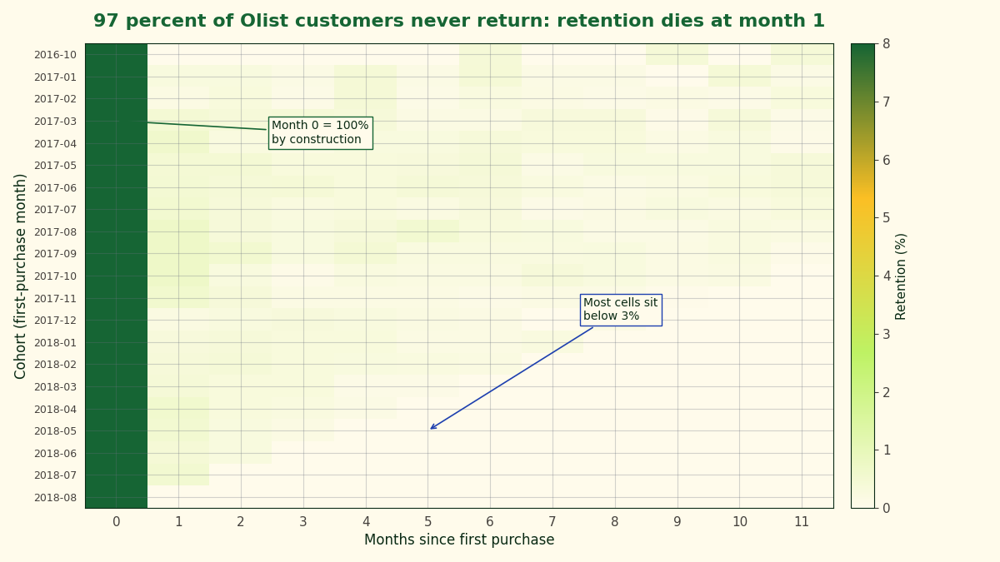

# 93,000 Customers and No Repeats: Olist Brazilian E-Commerce Analytics

Olist is a Brazilian marketplace platform. The public dataset covers 96,478 delivered orders across 93,358 unique customers from late 2016 through mid-2018, spread across nine CSV tables that join into a clean star schema. The interesting work is joining the tables, building an RFM segmentation that a marketing team could act on, and reading the cohort retention matrix to answer the one question every e-commerce operator asks about a dataset like this: how many of these customers come back?

Almost none. Of the 93,358 unique customers, 97 percent appear in exactly one delivered order during the window. The median order is R$ 105; the repeat-customer share is 3 percent; first-order revenue accounts for R$ 15.0M of the R$ 15.4M total. Platform revenue growth through 2017-2018 is almost entirely an acquisition story, not a retention story, and every downstream finding in this report sits under that fact.

## The data

Nine CSVs join around `orders` as the fact table.

| Table | Grain | Role |
| --- | --- | --- |
| `customers` | customer_id | Per-order customer record with `customer_unique_id` for cross-order identity |
| `orders` | order_id | Status, purchase timestamp, delivery timestamps |
| `order_items` | order_id x item | Per-line price and freight |
| `order_payments` | order_id x payment | Method, installments, value |
| `order_reviews` | review_id | Post-delivery star rating and free-text |
| `products` | product_id | Category, dimensions |
| `sellers` | seller_id | Location |
| `geolocation` | zip prefix | Lat/lon lookup |
| `product_category_name_translation` | category | Portuguese-to-English mapping |

Filtering to delivered orders drops 2,963 cancelled or unavailable rows, leaving 96,478 delivered orders. Rolling `order_items` up to order totals and joining on `customer_id` gives the single wide table the rest of the analysis runs on. Total revenue across the window comes to R$ 15.4M. Mean items per order is 1.14, so most orders are single-line-item purchases.

Revenue ramps from near zero in October 2016 through the first real growth in Q1 2017, peaks at R$ 1.15M during the Brazilian Black Friday window in November 2017, and settles around R$ 1.0-1.1M per month through 2018. The final month in the data cuts off partway through, so the last bar is a cutoff artifact rather than a slowdown.

## Method primer: RFM segmentation and cohort retention

Two techniques do most of the work in this report.

**RFM** segments a customer base along three axes. Recency is days since the customer's last order, measured from a chosen snapshot date; recent is better. Frequency is the count of distinct orders the customer has placed; more is better. Monetary is the customer's lifetime spend on the platform; higher is better. Each customer receives a score from 1 to 5 on each axis by **quintile binning on the rank**. Rank the full population on a given dimension, split the rank distribution into five equal-sized buckets, and assign scores 1 through 5. Ranking before binning matters because most Olist customers tie at frequency = 1, and `qcut` on the raw values would collapse to fewer than five distinct bins. The three scores combine into named segments: Champions (recent and frequent), New / Recent (recent but first-time), Big spenders (high monetary, still active), At risk (was frequent, now dormant), Lost (dormant and low-value), and Others (everyone in between). RFM is descriptive, not predictive; the segments are useful because marketing teams can point campaigns at them directly, not because they encode a forecasting model.

**Cohort retention** is the counterpart question at the platform level. A cohort is the group of customers who first ordered in a given calendar month. Retention at month N is the share of that cohort that placed another order in month N. The key property is that retention is conditional: it is always a percentage *of the original cohort size*, not of the active customer base. Month 0 is 100 percent by construction because every cohort member is, by definition, active in the month they first ordered. Reading the matrix means comparing across rows at the same column. If the September 2017 cohort retains better than the May 2017 cohort at month 3, then acquisition quality improved between May and September. If every row looks identical, the acquisition mix is stable and any retention fix needs to happen at the product or fulfilment layer.

## The RFM segments

| Segment | Customers | Revenue (BRL) | Revenue per customer |
| --- | ---: | ---: | ---: |
| Big spenders | 10,337 | 3,021,467 | 292 |
| Champions | 14,871 | 2,631,536 | 177 |
| At risk | 14,919 | 2,529,831 | 170 |
| New / Recent | 14,984 | 2,448,694 | 163 |
| Lost | 14,986 | 2,441,760 | 163 |
| Others | 23,261 | 2,346,486 | 101 |

Big spenders is the smallest segment by count but the largest by revenue total. R$ 292 per customer is nearly three times the R$ 101 that Others pulls. At risk is the segment a retention campaign would target first: 14,919 customers who historically placed more orders than the average but have gone dormant. Revenue is spread flatly across the middle segments, which is the marketplace equivalent of saying that no single segment dominates; the business is a long tail of roughly-equivalent buyers.

The two-panel scatter is the diagnostic that makes the frequency story visible. The left panel forces the 90,557-customer single-purchase cloud underneath the 2,801 repeat customers so the gold dots read as the minority they actually are. The single-purchase cloud is dense at low monetary and spread across the full recency axis, which matches the 97 percent share in the totals. The right panel isolates the repeat tail and colours it by monetary value — the high spenders are scattered across recency, so a retention program that indexes only on how recently someone last ordered would miss the repeat customers that actually paid. Frequency as a segmentation axis still fails because even among repeats, most orders cluster at frequency 2.

## The cohort reality

This is the figure that anchors the report. Each row is a cohort. Each column is months since first purchase. Each cell is the share of that cohort that ordered again in that month. Month 0 is the dark green column by construction. Every other cell sits at or below 3 percent retention. The best cohorts reach 4-5 percent retention at month 1, then drop under 2 percent by month 3 and never recover.

The practical implication is that Olist is not a retention business. The catalogue is dominated by durable goods (appliances, furniture, electronics, home accessories) that customers buy once and do not need again for years. Customer acquisition cost matters more than customer lifetime value here because LTV reduces to first-order value plus a small tail. A full LTV model with churn probabilities and discount rates is the wrong tool for this shape of data; the right tool is an acquisition-channel dashboard.

The teaching animation at `figures/olist-ecommerce-analytics-teaching.gif` builds the matrix row by row, cell by cell, so the reader can watch the conditional structure of retention fill in. Month 0 starts at 100 percent for each cohort, then the reveal walks rightward across each row, showing the drop to 3 percent or lower before moving to the next cohort below.

## Delivery time drives reviews

Orders delivered in 0-3 days average a 4.46-star review. At 15-21 days the average falls to 4.10. Past 30 days it drops to 2.30, well below the 3.0 threshold that typical recommend-scoring models treat as neutral-to-negative. Brazilian geography makes 40-day delivery times a real feature of the dataset's distribution, not an outlier class, and the cost shows up directly in the review column. A seller focusing on same-region buyers would see faster shipping, higher review scores, and better search-ranking feedback at the same time; a seller shipping nationally from a single warehouse would not.

## Revenue by state

Sao Paulo dominates every month in the observation window. The SP bar is consistently 2-3x the next state; Rio de Janeiro, Minas Gerais, Rio Grande do Sul, and Parana form a second-tier cluster. The ordering is stable across the whole window. No state overtakes SP, and the ratio between SP and the runner-up does not shift enough to suggest a changing market. For a marketplace operating in Brazil, the revenue base is a geography story first.

## What this isn't

Not a revenue forecast. The 2018 tail is incomplete; projecting 2019 from the final months would extrapolate a cutoff artifact. A forecast on this data needs to stop at the last full month.

Not a full LTV model. With 97 percent single-purchase customers, LTV reduces to first-order value plus a narrow tail. Running a BTYD model or a churn-probability pipeline on this data would produce numerically stable estimates that communicated less than the 3 percent repeat rate already does.

Not a vendor-economics analysis. Seller IDs are present, but seller costs, take rates, and fulfilment margins are not. Platform-side revenue per customer is observable; seller-side margin per customer is not.

## Reproducibility

Source, build scripts, and notebook live in the public repository at [github.com/ndjstn/olist-ecommerce-analytics](https://github.com/ndjstn/olist-ecommerce-analytics). Dataset: Olist Brazilian e-commerce dataset on Kaggle ([Olist, n.d.](#ref-olist)). To regenerate figures from a fresh clone: `uv run python scripts/build_figures.py`. To rebuild the Kaggle notebook: `uv run python scripts/build_notebook.py`.

## References

Olist. (n.d.). <em>Brazilian e-commerce public dataset by Olist</em> [Data set]. Kaggle. <a href="https://www.kaggle.com/datasets/olistbr/brazilian-ecommerce">https://www.kaggle.com/datasets/olistbr/brazilian-ecommerce</a>

Fader, P. S., Hardie, B. G. S., &amp; Lee, K. L. (2005). RFM and CLV: Using iso-value curves for customer base analysis. <em>Journal of Marketing Research, 42</em>(4), 415-430.

Blattberg, R. C., Getz, G., &amp; Thomas, J. S. (2001). <em>Customer Equity: Building and Managing Relationships as Valuable Assets</em>. Harvard Business School Press.

